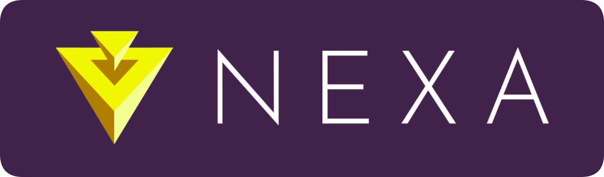

# Awesome Nexa

### ↳ https://nexa.org

A curated list of Nexa resources and projects.

If you want to add to the list, [here's how](CONTRIBUTING.md).

## List of content

- [Utilities](#utilities)
- [Blockchain API and Web services](#blockchain-api-and-web-services)
- [Wallets API](#wallets-api)
- [Open Source wallets](#open-source-wallets)
- [Blockchain Explorers](#blockchain-explorers)
- [C++ Libraries](#c-libraries)
- [JavaScript Libraries](#javascript-libraries)
- [PHP Libraries](#php-libraries)
- [Ruby Libraries](#ruby-libraries)
- [Python Libraries](#python-libraries)
- [Java Libraries](#java-libraries)
- [Scala Libraries](#scala-libraries)
- [.Net Libraries](#net-libraries)
- [Playgrounds](#playgrounds)
- [Blockchain dump](#blockchain-dump)
- [Full nodes](#full-nodes)
- [Read](#read)
- [Course](#course)
- [Additional Resources](#additional-resources)

## Official sites

- [Homepage](https://nexa.org/)
- [Matrix group](https://matrix.to/#/#nexacoin:matrix.org) (almost all discussion happens here)
- [Telegram group](https://discord.gg/JGEqqmS) (almost all discussion happens here)

## Non-official sites

- [Wiki](https://nexa.wiki/)

## Social media

- [Twitter](https://twitter.com/nexamoney)
- [Reddit](https://www.reddit.com/r/Nexa/)
- [YouTube](https://www.youtube.com/channel/UCH03nTnxs3TLmbSHtm54B1g)
- [Instagram](https://www.instagram.com/nexacoin/)
- [Forum]()

## Block explorers

- [Nexa Explorer (explorer.nexa.org)](https://explorer.nexa.org/)

## Faucets

- [TBD]()

## Trackers

- [CoinMarketCap]()
- [CoinGecko]()

## Exchanges

- ### Centralized
    - [TBD]()

- ### Decentralized
    - [Uniswap]()

## Mining
- ### Guides
    - [TBD]()

- ### Calculators
    - [minerstat](https://minerstat.com/coin/)
    - [CoinCalculators](https://www.coincalculators.io/)
    - [CoinToMine](https://cointomine.today/calculator/)
    - [CryptoRival](https://cryptorival.com/calcs/)

- ### Software
    - [COSMiC-v3 Bitbucket repo](https://bitbucket.org/LieutenantTofu/cosmic-v3/src/master/)
    - [SoliditySHA3Miner GitHub repo](https://github.com/lwYeo/SoliditySHA3Miner)

- ### Pools
    - [Nexa Rocks!](https://nexa.rocks/)

## Articles and explanations

- [Official whitepaper]()

## Videos

- [What is Nexa?]()

## Related projects

- [Bitcoin](https://bitcoin.org) Version 1.0
- [Bitcoin Cash](https://bitcoincash.org) Version 2.0

## Misc

- [TBD]()

---

Inspired by the [awesome](https://github.com/sindresorhus/awesome) list thing.
Created by Ava's DAO contributors.

---

### License

To the extent possible under law, [Ava's DAO](https://github.com/avasdao/) has waived all copyright and related or neighboring rights to this work.
